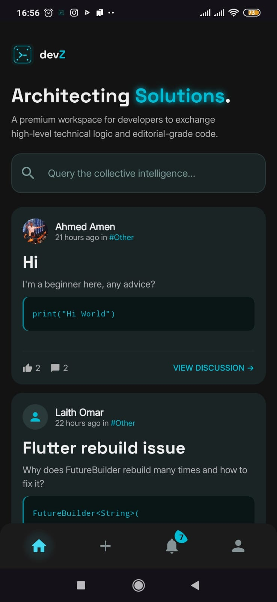
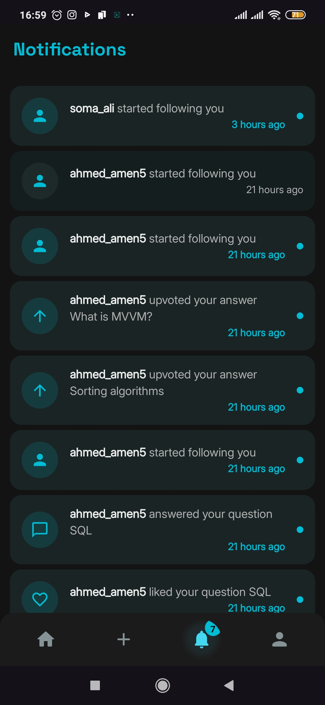
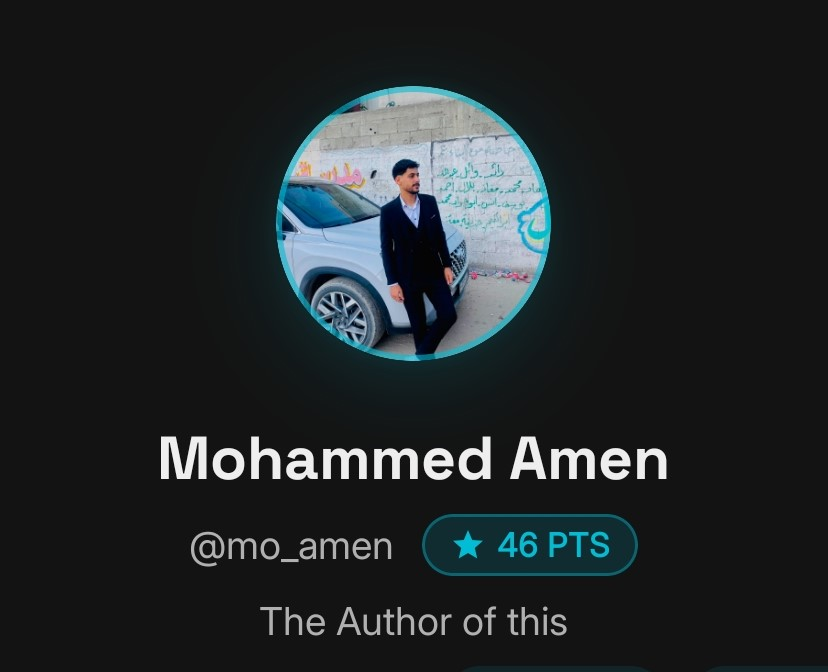

<div align="center">


# devZ

### A mobile Q&A platform built for developers

*Ask. Answer. Grow.*


</div>

---

## 📱 Screenshots

<div align="center">

### Splash & Onboarding
| Splash | Onboarding 1 | Onboarding 2 | Onboarding 3 |
|--------|--------------|--------------|--------------|
|  |  |  |  |

### Authentication
| Login | Sign Up |
|-------|---------|
|  |  |

### View Question & Details
| View Questions | Add Question | Question Details |
|----------------|--------------|------------------|
|  |  |  |

### Profile & Notifications
| View Profile | Edit Profile | Notifications |
|--------------|--------------|---------------|
|  |  |  

### Other
| Code Block | Gamefication |
|------------|--------------|
|  |  |

</div>


---

## 🔥 Features

- **Q&A Feed** — Paginated question feed with infinite scroll, pull-to-refresh, and category tabs by programming language
- **Search** — Debounced keyword search across question title, description, code, tags, and author name/username
- **Syntax Highlighting** — Custom tokenizer supporting Kotlin, JavaScript, Python, and a generic fallback
- **Code Copy** — One-tap clipboard copy for any code block
- **Voting & Acceptance** — Upvote answers, accept the best answer, and like/unlike questions
- **Gamification** — Points system rewarding every meaningful interaction (likes, upvotes, accepted answers, follows)
- **Profiles** — Full profile with skill chips, tech stack, social links, stats, and tabbed question/answer history
- **Follow System** — Follow/unfollow other developers with followers and following dialogs
- **Push Notifications** — Real-time FCM notifications for answers, likes, votes, and new followers
- **Deep Links** — Notification tap navigates directly to the relevant question
- **Search History** — Recent searches persisted in Supabase and surfaced as chips under the search bar
- **Dark Theme** — Dark-only Material Design 3 UI optimized for developer aesthetics

---

## 🏗️ Architecture

devZ follows **Clean Architecture** with the **MVI (Model-View-Intent)** pattern across all features:

```
Presentation Layer
  └── Composable Screen → ViewModel (onAction) → StateFlow<UiState>
          ↓
Domain Layer
  └── Repository Interfaces · Domain Models · Result<D, E> · Error
          ↓
Data Layer
  └── RepositoryImpl · RemoteDataSource (Supabase PostgREST)
      DataStore (UserPreferences) · Mappers
```

Every feature follows a **uniform MVI contract**:

| File | Role |
|------|------|
| `XxxAction.kt` | Sealed interface — user intents |
| `XxxState.kt` | Data class — `StateFlow<UiState>` |
| `XxxViewModel.kt` | Single `onAction()` dispatcher |
| `XxxScreen.kt` | Composable — collects state, fires actions |

---

## 🛠️ Tech Stack

| Category | Technology |
|----------|-----------|
| Language | Kotlin 2.3.20 |
| UI | Jetpack Compose (BOM 2026.03.01) + Material3 |
| Architecture | Clean Architecture + MVI |
| DI | Dagger Hilt 2.51.1 (KSP) |
| Backend | Supabase (PostgREST + Storage + Auth) via supabase-kt 3.6.0 |
| HTTP | Ktor Android |
| Push Notifications | Firebase Cloud Messaging |
| Image Loading | Coil (Compose + OkHttp) |
| Local Storage | DataStore Preferences |
| Serialization | Kotlinx Serialization JSON |
| Navigation | Compose Navigation (type-safe `@Serializable` routes) |
| Fonts | Inter (body) + Space Grotesk (titles) |
| Min / Target SDK | 26 / 36 |

---

## 🗄️ Database Schema

| Table | Key Fields |
|-------|-----------|
| `Account` | id, username, fullName, email, imageUrl, bio, techStack, skills, points |
| `Question` | id, title, description, code, tags, likesCount, answersCount, langTypeId, accountId |
| `Answer` | id, description, accepted, votedIds, questionId, accountId |
| `LanguageType` | id, type |
| `Notification` | id, message, type, isRead, userId, actorId, questionId |
| `SearchHistory` | id, query, accountId, createdAt |

---

## 🎮 Points System

| Trigger | Points |
|---------|--------|
| Someone likes your question | +1 |
| Someone unlikes your question | −1 |
| Someone upvotes your answer | +1 |
| Someone removes their upvote | −1 |
| Someone answers your question | +1 |
| Your answer is accepted | +3 |
| Your answer is un-accepted | −3 |
| Someone follows you | +1 |
| Someone unfollows you | −1 |

---

## 🚀 Getting Started

### Prerequisites

- Android Studio Hedgehog or newer
- JDK 17+
- A Supabase project with the schema above
- A Firebase project with FCM enabled

### Setup

1. **Clone the repository**
```bash
git clone https://github.com/your-username/devz.git
cd devz
```

2. **Add credentials** — Create a `local.properties` file in the project root:
```properties
SUPABASE_URL=https://your-project.supabase.co
SUPABASE_ANON_KEY=your-anon-key
```

3. **Add Firebase config** — Place your `google-services.json` inside `app/`

4. **Build and run**
```bash
./gradlew assembleDebug
```

---

## 🧪 Running Tests

```bash
# Unit tests
./gradlew test

# Instrumented tests
./gradlew connectedAndroidTest

# Lint
./gradlew lint
```

Unit tests use **JUnit 4 + MockK + kotlinx-coroutines-test + Turbine** and cover:
- Authentication ViewModel (login, signup, validation)
- Feed ViewModel (load, search, bookmarks, error states)
- Question Details ViewModel (like, vote, accept, points)
- Profile ViewModel (follow/unfollow, points)

---

## 📁 Project Structure

```
app/src/main/java/com/mohamed/devz/
├── DevZApp.kt                    # @HiltAndroidApp + notification channel
├── MainActivity.kt               # @AndroidEntryPoint + deep links
├── navigation/                   # Route.kt · DevzNavHost.kt · HomeScreen.kt
├── ui/theme/                     # Color.kt · Theme.kt · Type.kt
└── feature/
    ├── splash/
    ├── onboarding/
    ├── authentication/
    ├── core/
    │   ├── domain/               # Models · Repository interfaces · Result/Error
    │   └── data/                 # RemoteDataSource · DataStore · Mappers · Repos
    ├── question/
    │   ├── view_questions/
    │   ├── question_details/
    │   ├── add_edit_question/
    │   └── util/                 # Syntax highlighting tokenizer
    ├── profile/
    │   ├── view_profile/
    │   └── edit_profile/
    └── notification/
```

---

## 🧭 Navigation

```
Splash ──► Onboarding (first time)
       └──► Auth ──► Home
                      ├── Feed Tab       ──► QuestionDetails ──► Profile
                      │                  └──► AddEditQuestion
                      ├── Notifications Tab
                      └── Profile Tab   ──► EditProfile
```

FCM notifications deep-link directly to `QuestionDetails`.

---

## 👥 Team

| Name | Student ID |
|------|-----------|
| Mohammed Amen Ghazal | 120211235 |
| Saleem Kamel Abu Aser | 120212488 |
| Tareq Mohammed Almasry | 120210875 |

**Supervised by:** Dr. Rabhi Baraka  
**Faculty of Information Technology — Islamic University of Gaza**

---

## 📄 License

```
MIT License — feel free to use, modify, and distribute.
```

---

<div align="center">

Made with ❤️ in Gaza 🇵🇸

</div>
